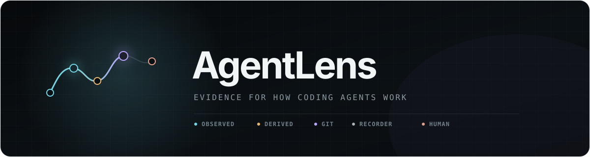
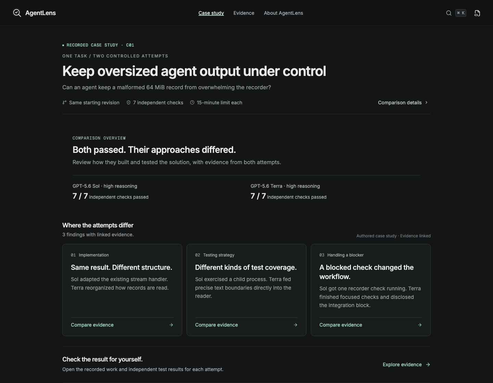
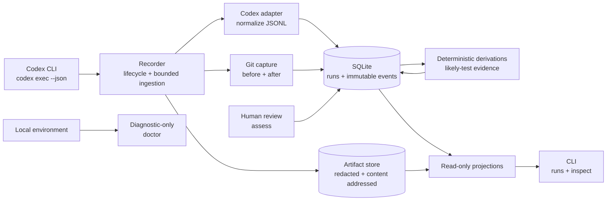

<p align="center">
  
</p>

<h1 align="center">See how coding agents actually work.</h1>

<p align="center">
  Local-first observability and evaluation for coding-agent runs.<br>
  Reconstruct execution trajectories, inspect failures and recovery, and judge outcomes from evidence rather than a final diff alone.
</p>

<p align="center">
  
  
  
</p>

<p align="center">
  <a href="#desktop-app">Desktop app</a> ·
  <a href="#quick-start">Quick start</a> ·
  <a href="#evidence-not-interpretation">Evidence model</a> ·
  <a href="#architecture">Architecture</a> ·
  <a href="#implementation-status">Status</a> ·
  <a href="#roadmap">Roadmap</a>
</p>

---

A final diff shows **what changed**. AgentLens preserves how the run unfolded—provider events, commands, Git state, recorder lifecycle, deterministic derivations, and human review—without collapsing them into one success claim.

<p align="center">
  <strong>OBSERVED</strong> — what the provider exposed &nbsp;·&nbsp;
  <strong>DERIVED</strong> — what AgentLens inferred &nbsp;·&nbsp;
  <strong>GIT</strong> — what the repository shows<br>
  <strong>RECORDER</strong> — what the harness observed &nbsp;·&nbsp;
  <strong>HUMAN</strong> — what the reviewer concluded
</p>

<p align="center"><code>observed fact ≠ derived inference ≠ Git state ≠ recorder fact ≠ human judgment</code></p>

## Product direction

The desktop comparison app lives under **apps/desktop**. Its saved C01 example compares two actual coding attempts on the same historical task. The live workspace can launch two coding agents from the same committed Git revision, preserve their recordings, and run a user-provided check command against separate copies of their results. The desktop is a source-run preview, not a packaged release.

A **standalone browser demo release candidate** now opens that real case with three destinations: Case study, Evidence, and About AgentLens. It uses selected recorded evidence and authored notes, with no API key or local backend required. Build it with `pnpm --filter @agentlens/desktop build:demo` and serve `apps/desktop/dist-demo/` on a static server. A public URL has not been published. See the [content inventory](apps/desktop/docs/public-demo-content.md) and [release checklist](apps/desktop/docs/public-demo-release-checklist.md).



## Experiment: Reflexio and retry-policy adherence

Two fresh coding-agent runs, one with retrieved Reflexio guidance and one without, both passed the same five checks. The guided implementation matched the taught retry scope more closely, but took longer. The write-up separates that observed difference from an unproven causal effect.

**[Read the experiment and inspect the reproducible evidence](./docs/experiments/reflexio-retry-policy.md)** — includes the synthetic correction, actual retrieved guidance, both implementations, independent evaluator, and limitations. Recheck the saved code without an API key.

## Desktop app

From the repository root:

```bash
pnpm install --frozen-lockfile
pnpm desktop
```

The Electron app includes recorded-attempt inspection, paired evidence, live comparison setup, user-defined command checks, and a configurable OpenAI-compatible insight engine. Optional dependency preparation supports the documented pnpm 11/macOS path, with setup results saved separately from agent and check outcomes. Preferences shows detected tools and the persistent data location. See [dependency preparation](./apps/desktop/docs/dependency-preparation.md) and [installation readiness](./apps/desktop/docs/desktop-installation-readiness.md) for supported behavior and remaining release gates.

Provider keys are encrypted locally; generation and the separate evidence-support review require explicit consent. TokenRouter GLM-5.3 completed two C01 analyses after response-limit tuning; semantic review still found claims that exceed their cited excerpts. Saved drafts remain accessible while failed or invalid support reviews cannot promote findings. Finding quality, cost and practical latency are being evaluated across available models. Claim inspection links individual assessments to server-resolved passages, while invalid reviews remain withheld. See the [latest evaluation](./apps/desktop/qa/insight-engine/PASSAGE-REVIEW-EVALUATION.md).

`pnpm dev:desktop` opens the browser development surface at http://127.0.0.1:5177. Configuration, comparison import and AI generation require Electron.

Recordings and provider settings are private runtime data, excluded from Git. Start with the recorded example, import a comparison bundle, or launch your own comparison from a clean local project after setup checks. See the [desktop guide](./apps/desktop/README.md), [endpoint setup](./apps/desktop/docs/insight-compatible-endpoints.md), and [migration notes](./apps/desktop/docs/repository-migration.md).

## Evidence, not interpretation

AgentLens treats provenance as part of the data model. These lanes can support or contradict one another; they are never silently collapsed into one success score.

| Evidence class | What it means | What AgentLens promises |
|---|---|---|
| **Observed** | Facts normalized from the provider stream: commands, lifecycle events, messages, file-change events, and usage when available. | Preserve the provider fact and its availability limits. Never claim access to private chain of thought. |
| **Derived** | Deterministic facts computed from durable observed evidence, currently including conservative likely-test classification and outcomes. | Link each derivation to its source event. A likely test passing is evidence—not proof the task is correct. |
| **Git evidence** | Initial/final repository state, tracked final diff, diff-check result, and bounded untracked-file metadata. | Describe repository state without claiming who authored a change or reading untracked contents. |
| **Recorder** | AgentLens lifecycle facts: timing, persistence, interruption, failure, and recovery. | Keep recorder behavior distinct from provider behavior. |
| **Human** | Explicit reviewer verdict, task-completion judgment, and an optional redacted note. | Preserve human judgment as its own timestamped evidence—not as a rewrite of observed or derived facts. |

## Why AgentLens?

Coding-agent review often starts too late. By the time a reviewer sees the final diff, the run's most useful debugging context has disappeared:

- Which paths did the agent try before finding the right one?
- Did the same test fail, then pass after a relevant change?
- Did the process complete normally, get interrupted, or require recorder recovery?
- Does the Git evidence agree with the agent's completion message?
- Is telemetry absent because nothing happened, or because the provider/capture policy could not expose it?

AgentLens keeps those questions answerable while refusing to manufacture certainty the evidence does not support.

## Current capabilities

Implemented in the current source tree:

- **Codex run capture** for the exact `codex exec --json` path.
- **Append-only run evidence** in local SQLite plus content-addressed, redacted artifacts.
- **Three capture policies:** `standard`, `metadata-only`, and `strict`.
- **Approved usage counters:** under `standard`, preserve only the five approved provider-emitted nonnegative safe-integer counters—input, cached input, output, reasoning output, and cache-write input. `metadata-only` and `strict` continue to omit content.
- **Git before/after evidence** from a clean repository, including tracked final diff and untracked-file metadata.
- **Run review commands:** `runs`, `inspect`, structured `--json`, and explicit `--native` inspection.
- **Conservative test-bearing evidence** for direct and bounded shell forms, with source relationships and attempt history. Supported compounds are detected without assigning the aggregate shell exit status to an individual test.
- **Explicit human assessment** with `success`, `partial`, `failure`, or `unreviewed` verdicts kept separate from task-completion judgment.
- **Read-only diagnostics** through `doctor`.
- **Loopback run UI** through `ui`, with bounded trajectories, an evidence inspector, retryable active-snapshot recovery, and a single final-page auto-fill when a completed run has at most one page remaining.
- **Desktop comparison preview** through `pnpm desktop`, with paired evidence, recorded-run inspection, saved-comparison imports and explicit provider-backed analysis jobs.
- **Lifecycle hardening** for interruption, process-group cleanup, abandoned-run recovery, bounded stream ingestion, and crash-gap derivation repair.

## Quick start

AgentLens is currently source-first; no published package is claimed here.

### Prerequisites

- Node.js 22.12 or newer (required by the desktop toolchain)
- `pnpm`
- an installed and authenticated Codex CLI
- a clean Git repository for the run you want to record

### Run from source

```bash
git clone https://github.com/Cmmatrubai/AgentLens.git
cd AgentLens
pnpm install --frozen-lockfile
```

Record a read-only Codex run in the current clean repository:

```bash
pnpm agentlens record --label "architecture tour" -- codex exec --json \
  "Inspect this repository and summarize its architecture. Do not modify files."
```

List the recorded runs, then inspect one by ID:

```bash
pnpm agentlens runs
pnpm agentlens inspect <run-id>
```

Machine-readable output is available on read commands:

```bash
pnpm agentlens runs --json
pnpm agentlens inspect <run-id> --json
```

> [!NOTE]
> The default data root is `~/.agentlens`. A custom `--data-root` must remain outside the repository being recorded. `record` intentionally refuses a dirty Git worktree.

<details>
<summary><strong>CLI reference</strong></summary>

| Command | Purpose |
|---|---|
| `pnpm agentlens record [--capture standard\|metadata-only\|strict] [--data-root PATH] [--label TEXT] -- codex exec --json ...` | Record one Codex execution. |
| `pnpm agentlens runs [--limit N] [--data-root PATH] [--json]` | List recent runs and evidence-backed summaries. |
| `pnpm agentlens inspect RUN_ID [--data-root PATH] [--json] [--native]` | Inspect one run, its chronological evidence, summary, Git facts, and current assessment. |
| `pnpm agentlens assess RUN_ID --verdict VERDICT [--task-completed yes\|no\|uncertain] [--note TEXT] [--data-root PATH] [--json]` | Append a human assessment and update its current projection. |
| `pnpm agentlens doctor [--data-root PATH] [--json]` | Diagnose local storage, Codex, process-group, and loopback readiness without repairing state. |
| `pnpm agentlens ui [--data-root PATH] [--no-open]` | Serve the authenticated local run ledger and evidence inspector on loopback. |

Example human review:

```bash
pnpm agentlens assess <run-id> \
  --verdict partial \
  --task-completed uncertain \
  --note "The targeted test passed, but the unrelated Git change still needs review."
```

</details>

## Architecture

The current implementation is a small TypeScript workspace with explicit boundaries between capture, canonical evidence, deterministic derivation, storage, and presentation.



Derived events are created only from already-durable, already-redacted observed command evidence. They are appended alongside their source relationship; they do not rewrite the source event or copy its command/output content.

## Reliability and privacy

AgentLens is designed as evidence infrastructure, so failure behavior and information boundaries are part of the product—not cleanup work for later.

### Reliability

- Recorder events are chronological and append-only.
- Interruption uses bounded termination with process-group cleanup on POSIX systems; resistant groups escalate from `SIGTERM` to `SIGKILL`.
- Finalization repairs eligible derivation gaps idempotently and records recoveries for open provider events.
- `runs` and `inspect` use immutable read-only database access, do not migrate or recover state, and fail closed when a WAL is present.
- The loopback UI reads bounded local projections. Active snapshots fail closed when a safe read is unavailable, and the client retries only the typed retryable refusal.
- Git collection refuses configured external filters, requires a clean starting worktree, and labels tracked diff separately from untracked metadata.

### Privacy

- The data root and database files are restricted to the local owner.
- `standard` capture stores redacted content; `metadata-only` and `strict` intentionally omit broader content classes.
- Sensitive-path policy and keyed redaction reduce accidental disclosure before persistence.
- Native provider payloads are not included in normal inspection output; reading eligible redacted native evidence requires `inspect --native`.
- AgentLens has no hosted service in the current implementation. The wrapped Codex process still follows its own provider/network behavior.

> [!WARNING]
> Secret detection and redaction are risk reduction, not a guarantee that captured data is free of sensitive material. Review evidence before sharing or exporting it.

## Known capability boundaries

The current Codex adapter does **not** claim authoritative source timestamps, complete file-read telemetry, private reasoning, complete tool durations, or complete tool output. Missing telemetry is reported as unavailable or partial rather than converted into zero.

Other intentional boundaries:

- only `codex exec --json` is accepted by the recorder today;
- test-bearing command classification is deliberately conservative: it accepts only direct commands and bounded shell envelopes, keeps supported compound outcomes individually unavailable, and rejects dynamic shell shapes;
- passing likely-test evidence never creates a human verdict or a task-success claim;
- independently detached descendants are outside the recorder's owned process-group guarantee;
- the CLI read path favors fail-closed purity over live-WAL inspection;
- untracked-file contents are not captured as Git evidence.

## Implementation status

| Surface | Status | Boundary |
|---|---|---|
| Codex `exec --json` recorder | **Available** | Current capture adapter; recording starts from a clean Git worktree. |
| Evidence, Git, derivation, and assessment CLI | **Available** | `runs` and `inspect` remain non-mutating; likely tests are evidence, not grading. |
| Production local UI | **Available** | Loopback-only run ledger, trajectory, inspector, Git evidence, and assessment presentation; bounded local reads retain explicit availability limits. |
| AGY / Claude adapters | **Planned** | No AGY or Claude capture adapter is implemented. |
| Desktop comparisons / Insights | **Source-run preview** | Recorded examples, imports, paired live execution, optional dependency preparation, independent command checks and insights are implemented. Packaged installation and broadly validated AI finding quality remain unfinished. |

The production UI direction is documented in the [Task 7 design](./docs/superpowers/specs/2026-08-30-agentlens-task-7-design.md), with execution gated by its [implementation plan](./docs/superpowers/plans/2026-08-30-agentlens-task-7.md).

## Roadmap

The long-term direction is staged so each layer earns the next one with real evidence:

1. **Single-run observability and evaluation — current.** Record Codex runs, preserve provenance, derive conservative test evidence, and support explicit human review.
2. **Local UI and dogfooding — current implementation.** The loopback-only run ledger, execution trajectory, evidence inspector, Git review, and assessment presentation are available for local runs.
3. **Multi-provider capture.** Add Codex + AGY capture, then Claude, while exposing provider capabilities instead of forcing false feature parity.
4. **Controlled same-task comparisons — desktop preview.** Launch recorded attempts in separate worktrees at one committed revision, inspect differences, and verify results with a user-defined command in separate copies. Packaging and broader setup support remain open.
5. **Benchmark Case and repeated attempts.** Treat one task definition plus repeated runs as a durable case—not as a leaderboard shortcut.
6. **Provider-capability-aware behavior features.** Extract comparable behaviors only where the provider evidence supports them; preserve unavailable states elsewhere.
7. **Insight Layer — engine implemented, quality evaluation pending.** Explicit provider requests, bounded evidence, validation and saved revisions are present. Evaluate useful findings across real tasks before claiming reliable cross-run judgment.

## Development

Install the workspace:

```bash
pnpm install --frozen-lockfile
```

Run the complete test suite and TypeScript build check:

```bash
pnpm test
pnpm typecheck
```

These root checks include the desktop package. Build both web and desktop with `pnpm build`; use `pnpm test:desktop` and `pnpm build:desktop` for focused desktop checks.

Run a focused workspace test directory when iterating:

```bash
pnpm vitest --run packages/derivations/test
```

## Project structure

```text
apps/cli/                    CLI commands, recorder orchestration, Git and lifecycle handling
apps/desktop/                Electron comparison UI, recorded readers, insight engine and desktop tests
apps/server/                 loopback API over recorded evidence
apps/web/                    existing browser run-review UI
packages/core/               canonical events, capture policy, redaction, artifact storage
packages/codex/              Codex JSONL decoding, normalization, capability declarations
packages/storage/            SQLite schema, migrations, repositories, read-only access
packages/derivations/        likely-test classification and evidence-backed run summaries
tests/fixtures/codex/        sanitized provider-stream fixtures
docs/                        frozen specifications, plans, and verification evidence
```

---

<p align="center">
  <strong>AgentLens is an execution flight recorder, not a scorecard.</strong><br>
  <sub>Observe the run. Preserve the evidence. Judge with context.</sub>
</p>
