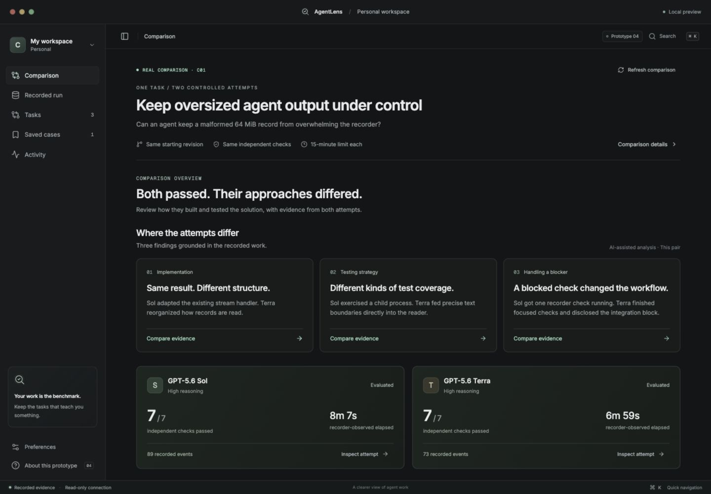

# AgentLens · Quiet Lab

## Browser demo release candidate

A standalone recorded C01 case is available as a static build. From this directory, run `pnpm build:demo` and serve `dist-demo/` with a static server. It opens the case, selected evidence and project explanation without installation or an API key. This build uses authored notes and public-safe selected evidence; it does not call the live insight engine.

See the [content inventory](docs/public-demo-content.md) and [release checklist](docs/public-demo-release-checklist.md). The public URL is not published yet. The desktop workflow below remains available separately.

The iterated desktop app now lives in the AgentLens workspace at **apps/desktop**. Use `pnpm desktop` from the repository root. See [migration and private-data notes](docs/repository-migration.md).

**Prototype 05 — reusable analysis over recorded comparisons.**

GPT-5.6 Sol/high and Terra/high completed the same historical coding task in separate clean repositories. Both passed all seven independent conditions, including the 265-test regression suite. A desktop insight engine accepts this pair or another supported saved comparison, sends reviewed excerpts to the user's configured OpenAI-compatible endpoint and model, and validates the returned evidence references. Live evaluation has exposed overclaims and incomplete reviews; broader quality validation remains unfinished. See the [latest catalog review evaluation](qa/insight-engine/CATALOG-REVIEW-EVALUATION.md). The existing setup workflow remains available with fictional sample data.



## Try it

```sh
pnpm install
pnpm desktop
```

`pnpm desktop` builds the interface and opens it in Electron. It loads local bundled files and does not need the development server. The first Electron launch may download its binary through the installed package.

For browser development:

```sh
pnpm dev:desktop
```

Open **http://127.0.0.1:5177**. From the repository root, run `pnpm build:desktop` followed by `pnpm preview:desktop` for the built browser preview (stop the development server first, because both use 5177). The coordinator's review instance is temporarily serving the built version at **http://127.0.0.1:5178**.

## Inspect the real comparison

Open **Comparison** in the sidebar or visit `/#/comparison`. The completed pair shows Sol at 8m7s and Terra at 6m59s, both 7/7. These are recorder-observed timings from one pair, not a general model ranking. Select a condition to inspect independent output, or **Inspect attempt** to see recorded work and final changes. **Comparison details** discloses the frozen controls and coverage limits.

Start with **Generated insights**. In Electron, open **Settings**, enter your provider's API base URL, model ID, and key (or select that the endpoint needs no key), and enable analysis. **API compatibility** selects Chat Completions or Responses and the server's JSON output support. See the [endpoint setup guide](docs/insight-compatible-endpoints.md). Saving settings makes no provider call. **Preview & generate** shows the destination, task, facts, declared controls, selected excerpts and coverage limits. Confirm the excerpts and choose **Generate insights** to make one explicit request. The comparison model names and the analysis model are separate choices.

Saved findings start in **Unreviewed draft**, with paired evidence, observations, interpretation and limitations still accessible. **Review evidence support** offers a separate provider request after reviewing the draft, excerpts, destination and limits. The reviewer divides each section into claims and selects IDs from a fixed passage catalog; AgentLens resolves the exact source text locally. Only findings whose claims all receive supported verdicts appear as main cards. **Inspect claim checks** exposes individual assessments and quoted passages on demand, with source text, source details, task requirements and saved attempt facts labeled separately. Flagged originals remain under **Needs review**. Failed, invalid or stale reviews preserve the draft without promoting it. This is an AI assessment, not a correctness guarantee: the [latest trial passed citation validation but still missed semantic errors](qa/insight-engine/CATALOG-REVIEW-EVALUATION.md).

The engine accepts zero findings, preserves analysis revisions, rejects invalid source references and withholds stale results. **Open pair** accepts the [normalized saved-comparison format](docs/insight-comparison-bundles.md). Browser preview can read saved drafts and reviews; configuration, import, generation and support-review requests require Electron.

The three existing C01 findings remain under **Case study notes**, separate from generated results. They are not included in the analysis prompt. Independent check outcomes remain separate from both kinds of analysis.

Evidence is preserved privately under `.local/comparison-C01/`; viewing the completed comparison does not run a model. See [the experiment report](experiments/C01/REPORT.md).

## Inspect the connected recording

Open **Recorded run**, or the real-recording card in **Tasks**. The local connection currently targets T01-A1: 102 events, 21 completed command actions, three failed commands, and eight files in the validated final Git diff.

Start with the failed test command or later validation. Open **Final changes** for the recovered Git artifact, or **Evidence ledger** to inspect any original event. **Source & provenance** explains missing model/usage metadata and the read-time check classification. **Refresh evidence** rereads the existing recording; it does not execute a model or alter the record.

This view requires a private local connection and an installed canonical AgentLens checkout. See [the connection guide](docs/real-run-connection.md). It works through restricted Electron IPC and a guarded local browser reader. Without a connection, the view reports unavailable evidence.

## Explore the sample comparison workflow

1. Choose **New comparison**, pick one of three sample cases, and select its success conditions.
2. Choose baseline/candidate roles and a shared timeout. The preview uses fictional models and does not enforce an execution timeout.
3. Review the configuration and select **Start demo comparison**. The approximately 23-second playback follows both attempts and evidence collection.
4. Navigate away and return using the current-comparison item in the sidebar. Try **Preview an interruption**, reload the window, and explicitly resume the recovered sample progress.
5. Open **Review comparison**. Its condition counts, model roles, timings and evidence follow your choices. Excluding the differing check can produce matching results; an uncaptured check stays unknown.
6. Inspect a check's output, illustrative patch and source context. **Compare this task again** reopens setup. Stop a running or interrupted demo to explore the cancellation path.
7. The existing saved-case library, task filters, command search (⌘K or Ctrl+K), compact spacing and reduced-motion preference remain available.

## What is implemented

- Native Electron window with local assets, React and TypeScript.
- Motion layout transitions, animated tabs, drawer/dialog entrance and exit, task filtering, setup transitions and live attempt progress.
- Radix dialog focus management and tooltips, cmdk keyboard search, Lucide icons, bundled Inter and Geist Mono.
- Validated three-step setup, frozen run configuration, background playback, cancellation, interruption/reload recovery and configuration-derived comparison results.
- Automated lifecycle, evidence-projection, analysis-binding, persisted-job, import, credential and local-file protection tests (`pnpm test`).
- Explicit BYOK analysis through Electron, with encrypted local credentials protected by the operating system, bounded evidence selection, structured output, source validation and saved revisions. No automatic retries or generation from a read.
- Three source-bound comparison findings with paired evidence, separate interpretation and observations, full-source disclosure, keyboard focus restoration and responsive layouts.
- Real recorded-run inspection through the existing AgentLens read-only CLI and validated artifact reader; complete stored event list, command filters, captured output, final diffs and source identity.
- Three coherent example tasks; same-task comparison, acceptance checks, model-specific evidence selection, illustrative patch and execution views.
- Search, status/repository filters, hash navigation with browser back/forward, accessible collapsed navigation.
- Case form validation, selected-condition persistence, saved-case details, removal/undo, and persisted preferences.

## Scope

**Comparison and Recorded run use real evidence. Tasks, setup, sample comparisons and saved cases still use fictional fixtures, with links into the real evidence views.** The simulation calls no model and executes no task commands. The recording bridge invokes the existing read-only AgentLens reader and Git revision lookup; it changes neither the recording nor repository source. A saved case opens its original sample comparison; it does not run an evaluation using edited conditions.

The completed comparison is **GPT-5.6 Sol / high** versus **GPT-5.6 Terra / high**, saved in `comparison-targets.json`. One startup failure is retained separately from the two completed coding attempts. The older historical recording is not attributed to either selected model.

Cases, preferences and the latest demo run use local storage for this preview. Starting a new run replaces the previous demo run; this is not a persistent evaluation history. An unsent setup draft is not restored after reload. Browser and Electron previews keep separate local data. This is a runnable design prototype, not the AgentLens production UI, a packaged/signed release, or a broad model benchmark.

The original approved source is preserved in `archives/prototype-01-source.zip`.

The source is now integrated as the `@agentlens/desktop` workspace package. The original ChatGPT-project prototype is retained as a backup. The existing web UI, Flight Console worktree and `design-prototypes/` remain separate surfaces.

## Design references and validation

See [the insight-engine verification report](qa/insight-engine/REPORT.md), [the findings verification report](qa/real-run/comparison-C01/findings/REPORT.md), [the comparison verification report](qa/real-run/comparison-C01/REPORT.md), [DESIGN.md](DESIGN.md) for references and design decisions, [the real-run verification report](qa/real-run/REPORT.md) for this iteration, [qa/ITERATION-02.md](qa/ITERATION-02.md) for the sample workflow, and [qa/REPORT.md](qa/REPORT.md) for the original iteration. The [comparison data contract](docs/comparison-data-contract.md) distinguishes this completed local pair from the remaining general execution backend.


Insight reviewer development now includes a [repeatable semantic evaluation suite](qa/insight-engine/SEMANTIC-EVALUATION.md). It distinguishes missed overclaims from incorrectly flagged supported claims, preserves the exact inputs and reviewer protocol, and provides an offline check before any paid run. The first six synthetic cases passed the target detection/control checks; complex real-case validation remains unfinished.


### Live recorded comparisons

**Your comparison** now launches two Codex attempts from one committed Git revision in isolated working copies, with durable live activity and independent stopping. Completed pairs open in the existing comparison and insight workflow. See [live workspace acceptance and handoff](docs/live-workspace-acceptance.md) for setup, verification, fixture-only testing, and current limits.
