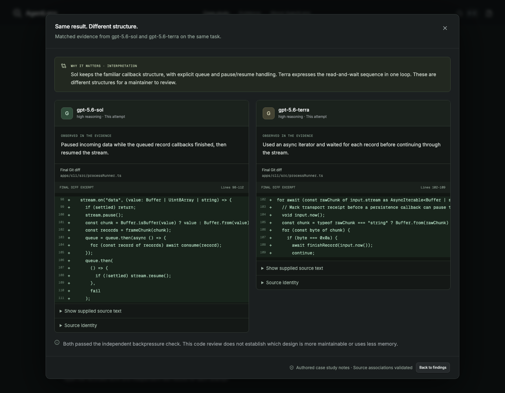

# Public case snapshot

This is a local release candidate for the recruiter-facing browser demo. It is not a published URL or a desktop installer.

## What visitors see

The C01 case asks two coding models to keep oversized output from overwhelming AgentLens. Both recorded submissions passed seven independent checks. Three authored, evidence-linked notes compare their implementation, tests and handling of blocked validation. These notes are separate from generated drafts and AI support reviews. One historical task does not establish a general model ranking.

The main destinations are **Case study**, **Evidence**, and **About AgentLens**. The case leads with the outcome and three differences; the evidence destination exposes the selected work and independent checks. Both navigation and quick search use the same destination list. Old sample routes resolve to the recorded case.

## Exact selected content

`public/demo/comparison.json` contains a serialized successful comparison response. `public/demo/manifest.json` records its byte count, SHA-256, original case/prompt identity, source mappings and omissions. These are the only public data assets.

| Attempt | Original recorded events | Exported events | Exported changed files | Independent results |
| --- | ---: | ---: | ---: | ---: |
| GPT-5.6 Sol, high | 89 | 3 | 3 | 7 |
| GPT-5.6 Terra, high | 73 | 3 | 2 | 7 |

The five selected file diffs are the stream reader and its test for each model, plus Sol's recorder integration test. The six selected events are the focused validation outputs and blocked integration output for each model, including Terra's final report. Each is referenced by an authored note. All fourteen independent check outputs are included. The original totals remain visible and are explicitly distinguished from the selected public records.

The exporter copies fields explicitly. It does not recursively copy `.local`, QA artifacts or recordings. Uncited events/files, startup failures, credentials, provider settings, generated drafts and review history are omitted. The package does not include a recording archive or claim a complete replay.

Workspace and temporary paths are replaced with declared placeholders. No substantive code or test outcome is rewritten. Source excerpts are checked against the selected original bytes before export; command details and exit status must match the recorded event. Displayed text receives fresh SHA-256 identities. The manifest retains original identifiers/hashes separately for provenance. The public prompt is likewise hashed after any transformation. The original private evidence is unchanged.

The current response is **218,848 bytes** with SHA-256 `1b1674f5c3a5460cdad31b6f372e55547891228e9eb8f9631382e421152be80b`. Its manifest records 26 source references, including repeated citations and check outputs. Runtime validation catches a mixed or damaged deployment; it cannot authenticate a malicious host replacing both manifest and response.

## Export and review

From `apps/desktop`:

```sh
pnpm export:demo
pnpm build:demo
```

Export requires the private original C01 archives, manifest and task prompt; build does not. The export fails on missing source/citation identities, incompatible event metadata, prompt mismatch, known credential patterns, unreviewed local paths and the 800,000-byte response limit. These checks supplement source review; they are not a universal detector of confidential content. Inspect any changed outgoing text before a later public release.

The reviewed current output contains no external URLs, email-like strings, user home paths or detected credentials. Event messages remain agent reports; successful independent checks do not turn those reports into verified explanations. The historical regression-test correction and coverage limits remain disclosed.

## Runtime boundary

`build:demo` emits `dist-demo/`. Its entry loads a small public shell around the existing comparison/evidence components. It uses only bundled static assets, with no local reader plugin, Electron bridge, `/api/*` requests or analysis calls. Provider settings, simulated execution and import controls are absent from the public journey. The normal desktop build and its native credential identity remain separate.

The browser trial served a copy of `dist-demo/` from an unrelated temporary directory under `/showcase/`; that server had no source tree, private recording directory or backend service. A clean browser exercised navigation, paired evidence, checks, recording selection disclosure, refresh, unsupported-route fallback, quick navigation, reduced motion and corrupted-asset handling.

See the [release checklist](public-demo-release-checklist.md). Hosting, an external verified URL and unfamiliar-reader usability testing remain pending.

## Verified interface

Screenshots from the isolated static build, not design mockups:



